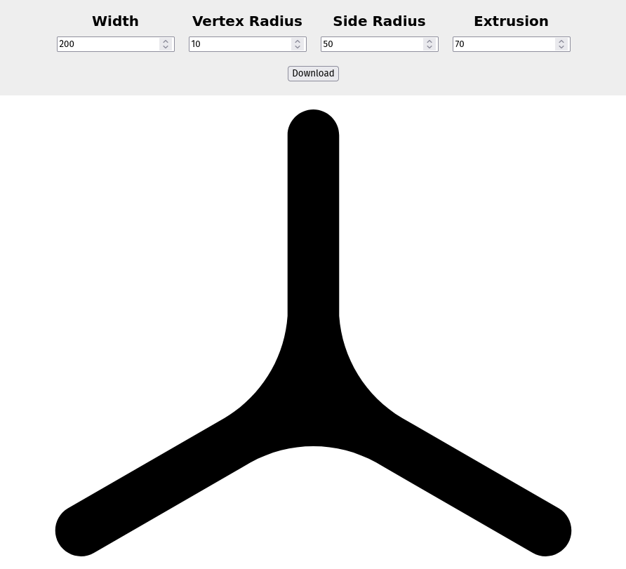

# Triangle Generator

This can be used to generate concave triangles and download them as svg files.

You can use the app [here](https://trimagnetix.github.io/triangle-generator).

## Running Locally

To run this app locally, you'll have to start a server first.

Something like this should work:
```
python3 -m http.server -d .
```


